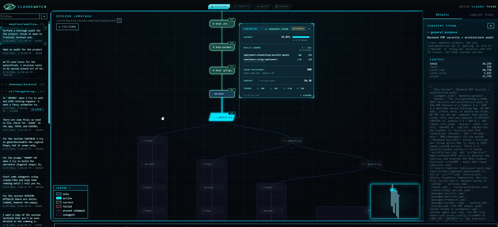
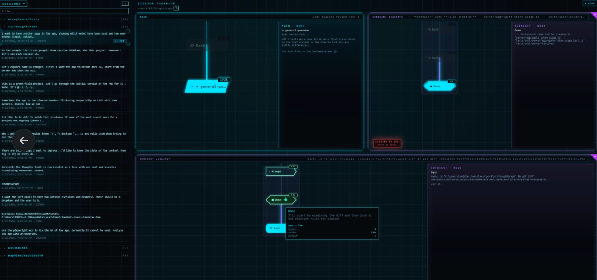
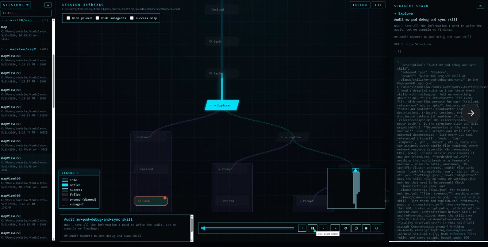
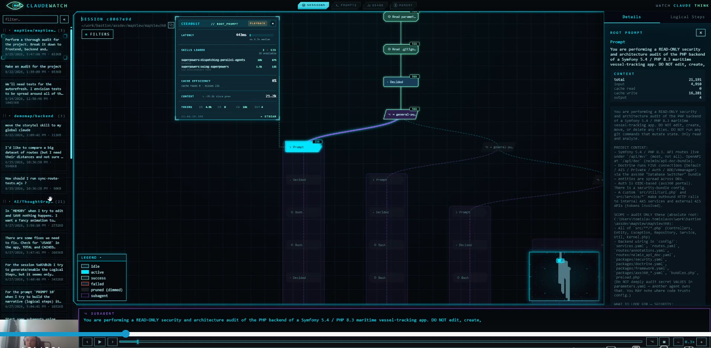
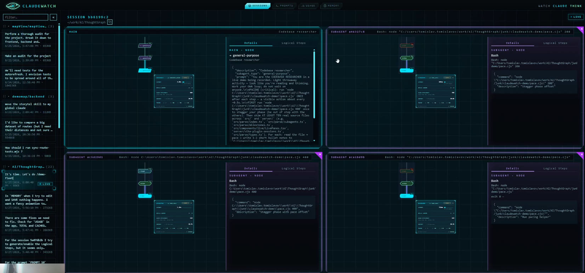
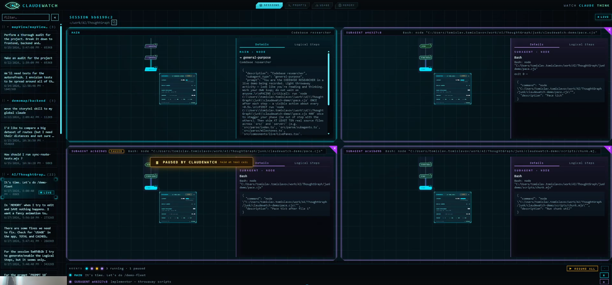
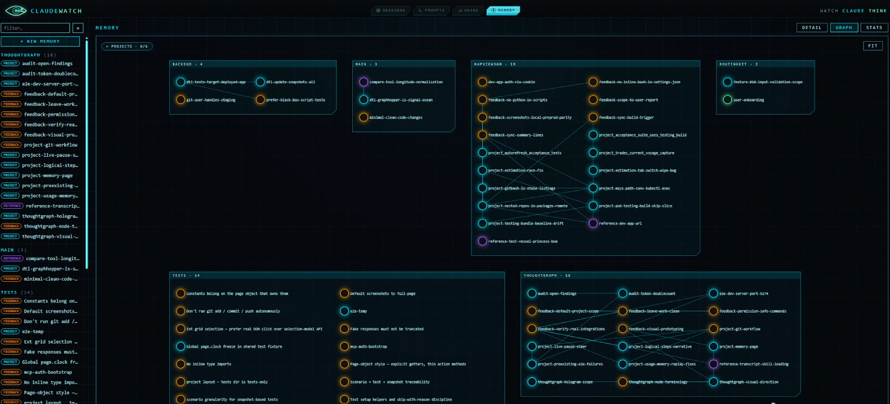
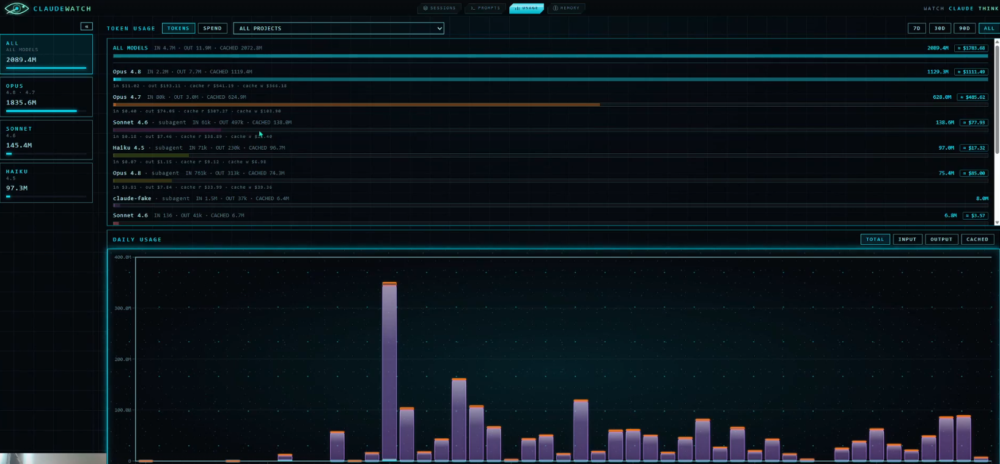
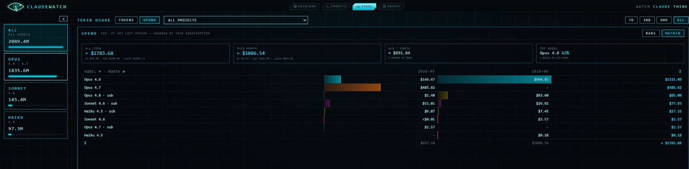

# AgentWatch

AgentWatch supports local Claude Code sessions and read-only Codex Desktop/CLI live monitoring
and replay. Both providers share the session library, graph, playback, filters, minimap, and
details. Prompts, Usage, Memory, Logical Steps, narration, and pause/steer remain Claude-only.

Watch a Claude Code agent *think*. AgentWatch reads Claude Code's own session logs from
your machine and turns each session into a navigable graph: every node is a **Thought** — a
prompt, a decision, a tool call, a subagent spawn, a completion — and edges link each
Thought to the ones that followed. A glowing playhead retraces the agent's path, lighting
up the trail it took, with failures in red, abandoned branches dimmed, and the winning path
brightened.

It also shows in-progress sessions live — and can **pause** a running agent (the main
agent, a single subagent, or all of them) at its next tool call, show you the tool call it's
holding on, and inject a steering note the agent reads when you resume. It aggregates token
**usage and cost** across all your sessions, and lets you browse and edit Claude Code's
memory store (global + per-project) with a force-directed graph view, health analysis, and
an editor that keeps `MEMORY.md` in sync automatically. A **Logical Steps** view (opt-in
per session) narrates the run as a few plain-language phase blocks — *Explore → Decide →
Implement → Verify* — two-way synced to the graph playhead, powered by a local `claude -p`
narrator.

No recording or instrumentation needed to *view* — run Claude Code as usual, then point
AgentWatch at the logs it already wrote. Pausing and steering are opt-in: the first time
you pause, AgentWatch installs a single `PreToolUse` hook entry into
`~/.claude/settings.json` (a timestamped backup is written first; nothing else is touched).
The control channel is **fail-open** — if AgentWatch isn't running, or you close it while
an agent is paused, the agent simply continues. It is never left stranded.

## UI showcase



| | |
|---|---|
|  |  |
|  |  |
|  |  |
|  |  |

## Quick start

```bash
npm install
npm run dev        # → http://localhost:5173  (open in Chrome or Edge)
npm run build      # production bundle in dist/
```

Sessions appear in the left sidebar when either provider has local data. Claude sessions
are read from `CLAUDE_HOME` (default `~/.claude/projects`). Codex rollouts are read from
`${CODEX_HOME}/sessions` (default `~/.codex/sessions`). Missing provider roots are ignored,
so either provider can be used independently.

## Documentation

- **[User Guide](docs/tech_docs/USER_GUIDE.md)** — for anyone using the app: reading the
  graph, playback, live sessions, the Usage & Spend page, and the Memory page. No coding required.
- **[Developer Guide](docs/tech_docs/DEVELOPER_GUIDE.md)** — architecture, the parsing
  pipeline, the data model, rendering/playback, the memory store, and how to extend it.
- **[`PRD.md`](PRD.md)** — product requirements. **[`docs/superpowers/`](docs/superpowers/)** —
  design specs and implementation plans, by feature.

## Stack

React 19 · TypeScript · Vite 6 · TanStack Query · D3 7.
Development uses Vite; `npm run build` creates the production bundle in `dist/`.
Tests: Vitest (unit) + Playwright (e2e, Chromium).

## Validation status

Run `npm run typecheck` for the TypeScript project, `npm test` for the unit suite,
and `npm run build` for the production bundle. GitHub Actions runs all three checks
for pull requests and pushes to `main`.
The test harness supplies jsdom `localStorage` compatibility for Node 25.
Development-tool dependency advisories are intentionally deferred and should be reviewed
before deploying this project beyond local development.
