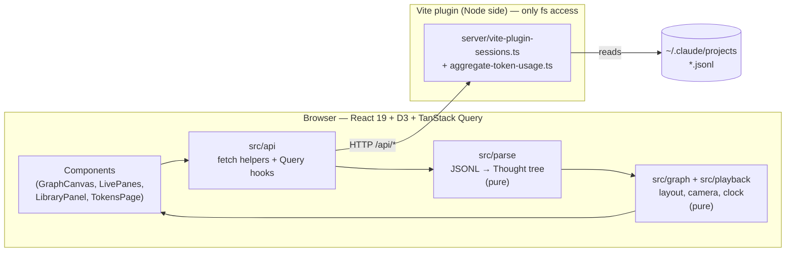
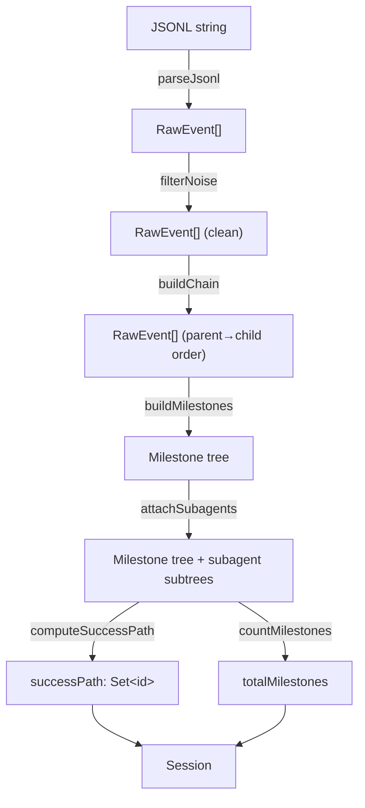
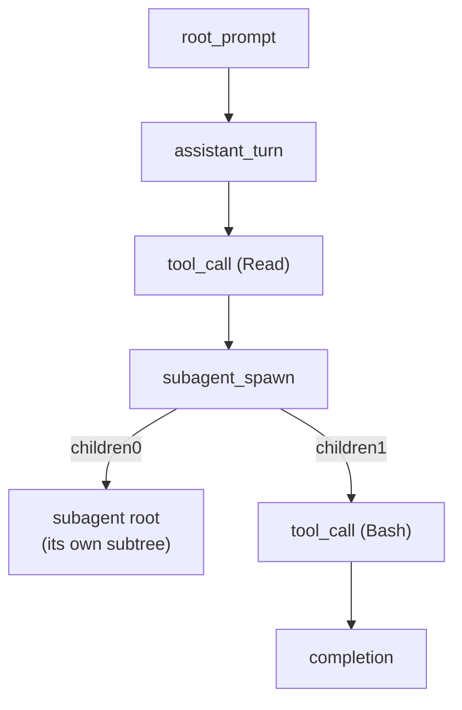
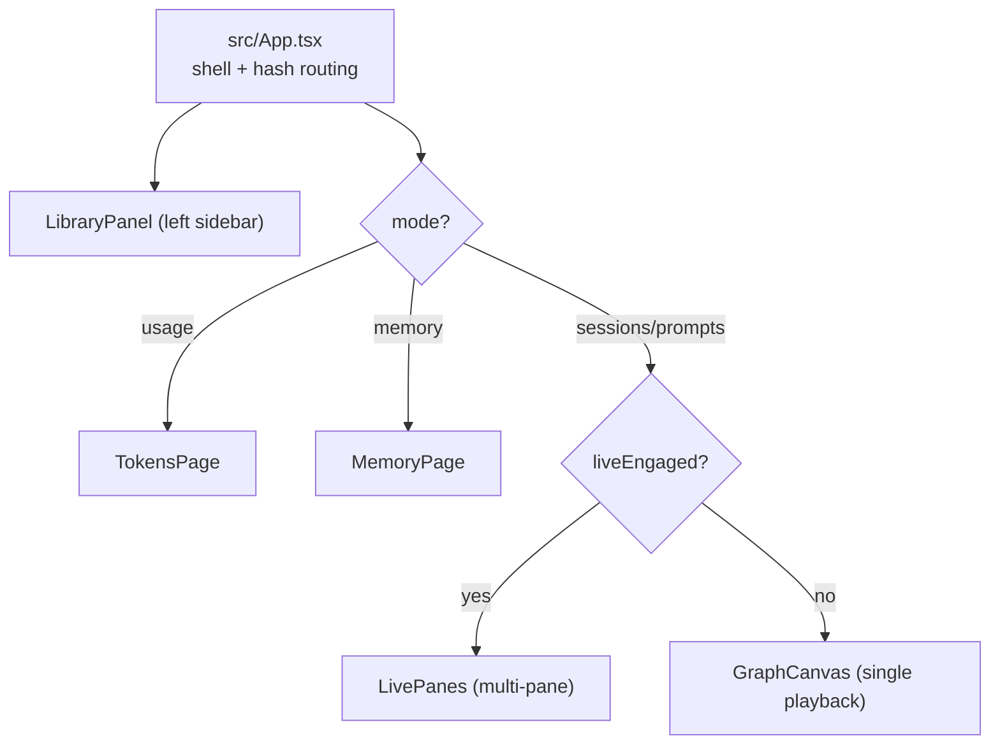

# AgentWatch — Developer Guide

> Technical onboarding for developers working on AgentWatch. For a non-technical
> walkthrough of the app, see [`USER_GUIDE.md`](./USER_GUIDE.md). For product intent
> and history, see the root `PRD.md` and the specs under `docs/superpowers/`.

---

## 1. What AgentWatch is

In AgentWatch, **nodes represent individual Thoughts** — the discrete steps in a
Claude Code agent's reasoning and execution: a prompt, a decision, a tool call, a
subagent spawn, a completion. The graph structure captures how those Thoughts connect:
edges link a Thought to the Thoughts that follow from it, so a whole session becomes a
visual, traversable network rather than a flat wall of JSONL.

A **playhead** moves through this graph during playback, drawing a glowing TRON-style
trail along the path the agent actually took. Failed steps glow red, dead-end branches
dim out, and the winning path to completion brightens. The visualization *is* the
product — the UI chrome stays deliberately minimal so the graph and its traversal take
focus.

AgentWatch reads Claude Code's own session logs off your local disk. There's no
recording step and no instrumentation: you run Claude Code as normal, then point
AgentWatch at the logs it already wrote.

---

## 2. Run it

```bash
npm install
npm run dev        # Vite dev server → http://localhost:5173
```

That single command boots both halves of the app — the React frontend and the Node-side
Vite plugin that reads session files (see §4). It is **dev-only**: there is no production
build target.

**Prerequisite:** a populated `~/.claude/projects` directory (i.e. you've run Claude Code
locally). Override the location with the `CLAUDE_HOME` env var — the e2e tests use this to
point at fixtures.

```bash
npm run typecheck  # tsc -b
npm test           # vitest run  (unit tests)
npm run test:watch # vitest      (watch mode)
npm run test:e2e   # playwright test (spins up its own server on :5174)
```

**Stack:** React 19, TypeScript 5.6, Vite 6, TanStack Query 5.51, D3 7.9. Tests: Vitest 3
(unit, jsdom) and Playwright 1.47 (e2e, Chromium only).

---

## 3. Architecture at a glance

AgentWatch is a single Vite app with a thin Node backend implemented as a Vite plugin.
The frontend never touches the filesystem; the plugin is the only code with `fs` access.



The plugin exposes four endpoints; the frontend consumes them through typed fetch helpers
wrapped in TanStack Query hooks. Parsing and layout are **pure** (no React, no DOM), which
keeps them unit-testable in isolation.

### Module boundaries

| Path | Responsibility |
|---|---|
| `server/vite-plugin-sessions.ts` | Vite plugin: HTTP endpoints, directory listing, JSONL streaming, path validation against `CLAUDE_HOME/projects` |
| `server/vite-plugin-narrative.ts` | Vite plugin: narrative endpoints; owns the per-session narrator store |
| `server/narrator.ts` | `claude -p` orchestration: prompt building, spawn/resume, JSON parsing, `TG_NARRATOR_FAKE` mode |
| `server/narrative-state.ts` | In-memory `NarrativeStore`: `start`/`tick`/`refresh` state machine, one run at a time per session |
| `server/plugin-shared.ts` | Shared helpers: `narratorCwd()`, `isNarratorProject()`, `isSafeId()`, `sendJson()` |
| `server/aggregate-token-usage.ts` | Walks all sessions, sums per-model token usage for the Token Usage page |
| `server/memory-store.ts` | Memory file parsing, serialization, index reconciliation, path safety, and read/write operations |
| `src/api/` | Typed fetch helpers (`client.ts`) + TanStack Query hooks (`hooks.ts`) |
| `src/parse/` | JSONL → semantic `Milestone` tree. Pure functions, no React, no D3 |
| `src/graph/` | D3 tree layout, viewport math, camera (`useCamera`). Pure inputs → laid-out nodes |
| `src/playback/` | `usePlayback()` animation clock + `useKeyboard()` shortcuts |
| `src/components/` | React UI: graph canvas, controls, HUD, minimap, detail panel |
| `src/components/live/` | Live multi-pane view for in-progress sessions |
| `src/narrative/` | Pure narrative logic — block types, verbosity re-bucketing, block diff, playhead↔block sync. No React, unit-tested. |
| `src/components/narrative/` | Logical Steps tab: `NarrativeTab`, `NarrativeBlock`, `VerbosityControl`, `RefreshButton`, `ArmillaryLoader`, `EnableNarrativePrompt` |
| `src/components/library/` | Left sidebar: Sessions / Prompts / Usage / Memory modes |
| `src/memory/` | Memory page: detail view, editor, graph, stats, insights derivation |
| `src/tokens/` | Token Usage page (chart, spend list, aggregation) |
| `src/theme/` | TRON color tokens + shared SVG glow filters |
| `src/util/` | Display helpers (`formatPath`, `formatTokens`) |
| `tests/` | Unit (`tests/unit/`) and e2e (`tests/e2e/`) + fixtures |

---

## 4. Data source

Claude Code and Codex store session logs as JSONL on disk:

```
~/.claude/projects/
  <projectId>/                        # projectId = the cwd, path-encoded
    <sessionId>.jsonl                 # the main session
    <sessionId>/
      subagents/
        agent-<id>.jsonl              # one file per spawned subagent
```

Codex rollouts are discovered recursively under `${CODEX_HOME}/sessions` (default
`~/.codex/sessions`) from files named `rollout-*.jsonl`. Their session metadata carries
the normalized cwd, thread ID, and optional parent thread ID used to build nested agents.

- **`projectId`** is the working directory with separators replaced by `-`. On Windows,
  `C:\Users\foo\proj` becomes `C--Users-foo-proj`. The plugin decodes this back to a cwd
  for display.
- Each **JSONL line is one event**, with fields including `uuid`, `parentUuid`,
  `timestamp`, `type` (`user` / `assistant` / various noise types), `isMeta`,
  `isSidechain`, and — for messages — a `message` block. Tool calls appear as `tool_use`
  content blocks inside assistant messages; results appear as `tool_result` blocks inside
  the *following* user message.
- The plugin reads these files directly and streams them as opaque JSONL strings. All
  interpretation happens in the frontend parser.

### Endpoints (served by the Vite plugin)

| Method + path | Returns | Notes |
|---|---|---|
| `GET /api/sessions` | `{ sessions: SessionMeta[], warnings: ProviderWarning[] }` | Merges available providers newest-first. An unavailable provider is reported as a non-blocking warning. Polled live. |
| `GET /api/sessions/:provider/:projectId/:sessionId` | `ProviderSessionPayload` | Provider-qualified main JSONL plus discovered child rollouts and timestamps. IDs are resolved through provider-owned indexes. |
| `GET /api/prompts` | `{ prompts: PromptMeta[] }` | Every user prompt across all sessions, newest first |
| `GET /api/token-usage` | `TokenUsageResponse` | Per-model token aggregation (see §8) |

Path safety: IDs are validated against `[A-Za-z0-9._-]+`. Claude additionally enforces
root containment; Codex resolves IDs only through its discovered file index, so request
segments are never interpreted as filesystem paths.

---

## 5. The parsing pipeline

The parser turns raw JSONL into a tree of `Milestone` nodes — each milestone is one
Thought. Entry point: `parseSession(payload)` in `src/parse/index.ts`.



**Stage by stage:**

1. **`filterNoise`** (`filter.ts`) drops events that carry no semantic step:
   `file-history-snapshot`, `attachment`, `system`, `last-prompt`, `permission-mode`,
   `ai-title`, `queue-operation`; anything with `isMeta: true`; CLI command-wrapper /
   local-caveat user messages; and empty assistant turns.
2. **`buildChain`** (`chain.ts`) reorders events into a parent→child tree by walking
   `parentUuid → uuid`. **Timestamps are not authoritative for ordering** — they can be
   out of sequence — so the parent-pointer chain is the source of truth. A final sweep
   picks up any nodes orphaned by filtering.
3. **`buildMilestones`** (`milestones.ts`) collapses the event chain into `Milestone`s:
   it collects all `tool_result` blocks, then walks events emitting one milestone per
   semantic step, merging each `tool_use` with its matching result. Labels, summaries and
   results are produced by `extract-label.ts`, `extract-summary.ts`, `extract-result.ts`
   (`sentence.ts` provides "first sentence" extraction). The final assistant turn is
   promoted to `completion`; token `usage` is attached and propagated back onto the prompt
   that triggered each response.
4. **`attachSubagents`** (`subagents.ts`) parses each `agent-*.jsonl`, builds its milestone
   tree, and attaches it under the matching `subagent_spawn` node. Matching tries, in
   order: the explicit `agentId` in the spawn's tool result → timestamp proximity → file
   order.
5. **`computeSuccessPath` + taint** (`failure.ts`) marks any milestone whose tool result
   errored (or whose Bash exit code ≠ 0) as `failed`; a branch containing a failure is
   *tainted*. The success path is the chain from root to the final completion excluding
   tainted branches, stored as a `Set<id>` for O(1) "is this on the success path?" lookups.
6. **`sliceSession`** (`slice.ts`) is a post-parse transform used by Prompts mode: given a
   prompt id, it extracts the contiguous slice of the main trail from that prompt up to
   (but excluding) the next `user_followup`, rebuilds it as a fresh sub-tree, and
   recomputes `totalMilestones` and the intersected success path.

### The tree shape

The `children` array encodes structure. A normal milestone has one child (the next step).
A `subagent_spawn` has two: `children[0]` is the subagent's subtree (a side branch),
`children[1]` is the main flow continuing. D3's tree layout handles both uniformly.



### Data model (`src/parse/types.ts`)

```typescript
type MilestoneKind =
  | 'root_prompt'      // first user message
  | 'assistant_turn'   // assistant text, no tool call
  | 'tool_call'        // one tool_use + its result
  | 'subagent_spawn'   // a Task/Agent tool call
  | 'user_followup'    // a later user message
  | 'completion';      // the final assistant turn

type Milestone = {
  id: string;             // event uuid; "<uuid>#<toolId>" for tool calls
  kind: MilestoneKind;
  label: string;          // short on-node label, e.g. "Read slice.ts"
  summary: string;        // one-line action (~160 chars)
  result?: string;        // one-line outcome (tool calls only)
  detail?: string;        // full text for the detail panel
  timestamp: string;
  failed: boolean;
  toolName?: string;      // for tool_call / subagent_spawn
  raw: unknown;           // original event(s), kept for the detail panel
  children: Milestone[];  // see "tree shape" above
  usage?: ContextUsage;   // token usage from the assistant event
  contextSize?: number;   // input + cacheRead + cacheCreation
};

type Session = {
  id: string;
  cwd: string;
  startedAt: string;
  root: Milestone;
  successPath: Set<string>;
  totalMilestones: number;
  subagentMtimes: Record<string, string>;  // subagentId → ISO mtime
};
```

---

## 6. Rendering & playback

The renderer is pure-data-driven: D3 computes layout coordinates, React renders the SVG,
and the playback clock advances an index. No imperative D3 transitions fight React's
reconciler.

### Layout (`src/graph/layout.ts`)
`d3.tree()` with **fixed node spacing** (`nodeSize([140, 110])`) produces `{x, y}` per
node — a top-down tree. Layout is memoized two ways: a `WeakMap` keyed on the root object,
and an LRU (cap 16) keyed on a structural fingerprint, so re-parses of the same shape don't
re-lay-out.

### Camera (`src/graph/useCamera.ts`, `viewport.ts`)
The camera is a zoom transform `{k, x, y}` (scale clamped to `[0.2, 8]`). Two modes:

- **FREE** — manual pan/zoom via d3-zoom. Any wheel/drag turns FOLLOW off.
- **FOLLOW** — the camera animates to keep the playhead in view. At follow zoom the
  viewport shows **9 nodes** vertically (`FOCUS_VISIBLE_NODES = 9` × `NODE_Y_SPACING 110`),
  with the playhead placed **30% from the top** (`FOCUS_VERTICAL_RATIO = 0.30`) so most of
  the frame is lookahead. Transitions tween over `TWEEN_MS = 280`; a `PROGRAMMATIC_GUARD_MS`
  window prevents programmatic tweens from being misread as user input that would flip
  FOLLOW off.

Helper transforms: `fitTransform` (whole graph to viewport), `focusOnTransform` (follow
framing), `initialFrameTransform` (root anchored near top at 1:1 on first load).

### Playback clock (`src/playback/usePlayback.ts`)
State: `{ order, index, edgeProgress, playing, speed, finished }`. `order` is a **depth-first
flatten** of the tree — which makes subagent traversal temporally faithful: when the trail
reaches a spawn, it descends into the subagent subtree before continuing the main flow. A
RAF loop accumulates wall-clock time; `BASE_MS_PER_NODE = 400` divided by `speed`
(`0.25 / 0.5 / 1 / 2 / 4`) sets the pace. `index` and `edgeProgress` live in a single state
slot to avoid double-advancing on a React re-invoke.

### Keyboard (`src/playback/useKeyboard.ts`)

| Key | Action |
|---|---|
| `Space` | play / pause |
| `→` / `←` | step forward / back one node |
| `F` | fit whole graph |
| `L` | toggle FOLLOW |
| `\` | toggle sidebar |
| `Esc` | close detail panel |

### Visual states
Each node resolves to one of: **idle** → **active** (the playhead) → **success** (on the
winning path after finish) — with **failed** (red) and **pruned** (tainted, dimmed)
branching off. Node *shape* encodes kind (chevron = prompt, octagon = tool, parallelogram =
subagent, hexagon = completion). Edges animate a `stroke-dashoffset` "line-draw" as the
trail advances, then fade with a comet-tail freshness gradient behind the playhead. A
single shared SVG glow `<filter>` (`src/theme/Filters.tsx`) is reused across all glowing
elements — never per-node — for performance. Color tokens live in `src/theme/tokens.css`.

The minimap (`Minimap.tsx`) renders the whole graph scaled down with a draggable viewport
rect; click to jump, drag to pan, wheel to zoom.

---

## 7. The feature areas



`App.tsx` is the shell. View switching is **hash-based** (`#/tokens` ⇒ Token Usage),
hand-rolled with no router. Sidebar `mode` (`sessions` / `prompts` / `usage` / `memory`) and
several UI preferences persist to `localStorage`.

### 7.1 Graph view
The default view. `GraphCanvas` renders the laid-out tree; `usePlayback` drives the
playhead; `PlaybackControls`, `NowPlaying` (HUD readout), `NodeTooltip`, `DetailPanel`,
`Legend`, `FilterToggles`, `CanvasToolbar` and `Minimap` surround it. When a **prompt** is
selected (not a whole session), `App.tsx` builds an `effectiveSession` via
`sliceSession(rawSession, promptId)` and feeds that scoped tree to all the same components.

### 7.2 Live sessions (`src/components/live/`)
A session is **live** if its file mtime is younger than `LIVE_THRESHOLD_MS` (180 s).
`useSessionList` polls every `POLL_MS` (7 s); opening a live session auto-engages the
**multi-pane** view — one pane for the main agent trail (`extractMainTrail`, which excludes
inner subagent subtrees) plus one pane per active subagent (`extractSubagentPaneRoot`).
While live, `useSession(…, live=true)` refetches and **re-parses in full** each poll;
`structuralSharing: false` (see §9) is essential here. Each subagent pane runs a
state machine (`paneStatus.ts`): `active → closing → closed`, with a `frozen` escape hatch.
A subagent goes `closing` after `SUBAGENT_STABLE_MS` (30 s) of no writes and then closes
after a `CLOSING_MS` (30 s) countdown — shown by `CountdownChip`, which the user can hover
to abort and click to freeze. Live playback (`livePlayback.ts`) is synthetic: no scrubbing,
the newest node is always the head.

### 7.3 Library panel (`src/components/library/`)
The left sidebar has three modes via a dropdown (persisted at `tg.library.mode`):

- **Sessions** — every session, grouped by project, with rename (double-click) and a
  pulsing `LiveTag` on live ones.
- **Prompts** — every user prompt (`/api/prompts`); selecting one renders that prompt's
  scoped slice (see §7.1).
- **Usage** — token usage cards; the full page lives at `#/tokens`.

Shared: substring filter, draggable/collapsible project groups (order + expansion in
`localStorage`), and a resizable/collapsible sidebar.

### 7.4 Token Usage page (`src/tokens/`)
See §8.

### 7.5 Narrative view — Logical Steps (`server/vite-plugin-narrative.ts`, `src/components/narrative/`)

The **Logical Steps** tab in the right inspector narrates a session as a small set of
plain-language phase blocks (e.g. *Explore → Decide → Implement → Verify*) sitting
alongside the graph. It is **opt-in per session**: nothing calls a model until the user
clicks *Enable* for that session.

**Server architecture.** Three files own the Node side:

- `server/narrator.ts` — `runNarrator()`: spawns `claude -p --output-format json
  --model <model>` with the prompt on stdin. On the first call there is no `--resume`;
  subsequent incremental calls add `--resume <narratorSessionId>` and pass only the
  milestone delta since `lastSummarizedId`. JSON output is parsed defensively by
  `parseBlocks()` (tolerates prose + fences); malformed output keeps the last good
  block set. When `TG_NARRATOR_FAKE=1`, `runNarrator()` returns two canned blocks for
  deterministic unit and e2e tests.
- `server/narrative-state.ts` — `createNarrativeStore()`: in-memory `Map<key,
  Entry>` keyed by `${projectId}/${sessionId}`. Exports `start` (Haiku, no resume),
  `tick` (Haiku, `--resume`, delta milestones only; skips if nothing new), `refresh`
  (Sonnet, clears `narratorSessionId` for a fresh conversation). One run at a time per
  key; `tick` is a no-op if a run is already in flight.
- `server/vite-plugin-narrative.ts` — `narrativePlugin()`: registers the four
  endpoints under `/api/narrative`. Narrators run from the fixed cwd returned by
  `narratorCwd()` (`<os.tmpdir()>/thoughtgraph-narrator`), so their JSONL logs all
  decode to a single known `projectId`. `isNarratorProject(projectId)` detects this
  marker and is used to **exclude** narrator sessions from `/api/sessions`,
  `/api/prompts`, and the token-usage aggregator — they never appear in session lists or
  inflate usage counts.

**Endpoints:**

| Method + path | Purpose |
|---|---|
| `POST /api/narrative/:projectId/:sessionId/start` | Enable + initial Haiku build. Returns the current `NarrativeState` immediately (build runs async; poll `building` to track). |
| `POST /api/narrative/:projectId/:sessionId/tick` | Incremental Haiku update with new milestone delta (`--resume`). Does **not** invalidate the GET query — the GET self-polls on the existing 7 s cadence to avoid a request storm. |
| `POST /api/narrative/:projectId/:sessionId/refresh` | Full Sonnet rebuild in a fresh narrator conversation. Invalidates the GET query on success. |
| `GET /api/narrative/:projectId/:sessionId` | Returns `NarrativeState` — `blocks[]`, `building`, `error`, `model`, `generatedAt`. LIVE polling uses this at `POLL_MS` (7 s). |

**Model tiers.** `start` and `tick` always use Haiku (cheap, fast; prompt cache serves
the retained transcript at ~0.1× on ticks). The ⟳ Refresh button triggers a full
Sonnet rebuild from scratch.

**Client data layer.** `src/api/hooks.ts` exports `useNarrative` (GET, polls when
live), `useStartNarrative`, `useTickNarrative` (no `onSuccess` invalidation — deliberate,
see above), and `useRefreshNarrative` (invalidates on success). `src/narrative/`
hosts pure helpers: `types.ts` (block types), `rebucket.ts` (verbosity grouping),
`diffBlocks.ts` (animation triggers), and `sync.ts` (exports plain functions
`buildIndexMap`, `indexForBlockStart`, `activeBlockId` for playhead ↔ block mapping using
milestone-id ranges). `src/components/narrative/` hosts the React rendering components:
`NarrativeTab`, `NarrativeBlock`, `VerbosityControl`, `RefreshButton`, `ArmillaryLoader`,
`EnableNarrativePrompt`.

**Verbosity.** Three levels — **Overview / Steps / Detailed** — are applied entirely
client-side by `rebucket.ts` with no model call: Overview collapses blocks to their
`phase` group, Steps shows all blocks, Detailed shows blocks with the `detail` field
expanded. Only ⟳ Refresh re-tunes wording via a model call.

**Two-way sync.** Each `NarrativeBlock` carries `startMilestoneId` / `endMilestoneId`.
Clicking a block scrubs the playback playhead to `startMilestoneId`; the playhead
advancing highlights the block whose range covers the current milestone.

**Testing.** Set `TG_NARRATOR_FAKE=1` to replace real `claude -p` spawns with
`fakeBlocks()` (two canned blocks). The e2e suite uses this; unit tests mock `runNarrator`
directly. Pure helpers (`rebucket`, `diffBlocks`, `parseBlocks`, `toNarratorInput`,
`isNarratorProject`) are unit-tested in isolation.

### 7.6 Memory page (`src/memory/`, `server/memory-store.ts`)

The Memory page lets users browse, read, and edit Claude Code's memory store. It is the
app's first feature with **write endpoints**, so the architecture has an explicit safety
layer described below.

**Data source.** Memory files are markdown-with-YAML-frontmatter under the Claude home
directory (`CLAUDE_HOME`, default `~/.claude`):

- **Per-project**: `projects/<projectId>/memory/<name>.md`
- **Global**: `memory/<name>.md` — note this is a sibling of `projects/`, not inside it.
  `CLAUDE_HOME` points at the `projects/` directory, so `memoryDirFor('global')` resolves
  one level up.

Each scope also contains a `MEMORY.md` index file listing its memories one per line:
`- [Title](file.md) — hook`.

**Server: `server/memory-store.ts`.** All filesystem access for memories is in this
module. Key exports:

- `parseMemoryFile(raw)` — extracts frontmatter fields (`name`, `description`, `type`,
  `originSessionId`) + body + deduplicated `[[name]]` links. Tolerant: a malformed
  frontmatter produces a `parseError` rather than throwing.
- `serializeMemory({ name, description, type, originSessionId, body })` — writes the
  canonical frontmatter + body, preserving `node_type` and `originSessionId`.
- `parseIndex(raw)` / `upsertIndexLine` / `removeIndexLine` — read and reconcile the
  `MEMORY.md` index.
- `isMemoryName(name)` — validates a slug against `^[a-z0-9][a-z0-9-]*$`; rejects any
  separator or traversal attempt.
- `resolveMemoryFile(projectsRoot, scopeKey, name)` — builds the absolute path to a
  memory file. Calls `isMemoryName` first so the result can never escape the scope
  directory — no `path.resolve` needed to contain it.
- `readMemoryStore(projectsRoot)` — aggregates every memory across global + all project
  scopes, returning `MemoryResponse` (`memories: MemoryRecord[]` + `indexes`). Returns
  empty when the directory does not exist.
- `createMemory` / `updateMemory` / `deleteMemory` — the three write operations. All
  three backup the prior file to `memory/.backups/<name>.<mtime>.md` before modifying
  or deleting, and call `upsertIndexLine`/`removeIndexLine` to keep `MEMORY.md` in sync.
  `createMemory` returns `409` (via a thrown error caught by the endpoint) when the file
  already exists.

**Endpoints (registered in `server/vite-plugin-sessions.ts`):**

| Method + path | Action |
|---|---|
| `GET /api/memory` | Read the full store — all memories + index entries |
| `POST /api/memory/:scopeKey` | Create; body `{ name, description, type, body }` |
| `PUT /api/memory/:scopeKey/:name` | Update; body `{ description, type, body }` |
| `DELETE /api/memory/:scopeKey/:name` | Delete; response includes `brokenBacklinks[]` |

`scopeKey` is validated with the existing `isSafeId`; `name` is validated with
`isMemoryName`. These are the app's only write endpoints.

**Frontend data layer.** `src/api/client.ts` exports `fetchMemory`, `createMemory`,
`updateMemory`, and `deleteMemory`. `src/api/hooks.ts` exposes `useMemoryList`
(key `['memory']`), `useCreateMemory`, `useUpdateMemory`, and `useDeleteMemory` — each
mutation invalidates `['memory']` on success.

**Components (`src/memory/`)**:

- `MemoryPage.tsx` — main pane. Owns the **DETAIL / GRAPH / STATS** tab toggle and the
  selected memory. Rendered by `App.tsx` when `mode === 'memory'`; bypasses the
  session-loading machinery entirely. Also handles the create flow: when `creatingScope`
  is set (triggered by the sidebar's **+ NEW MEMORY** button) it renders `MemoryEditor`
  in create mode instead of the detail/empty state.
- `MemoryDetail.tsx` — reading view: name, type badge, scope/cwd, body (via
  `renderBody`), and a **CONNECTIONS** section with outgoing links, backlinks, and a
  "jump to origin session" button. Hosts edit and delete actions. Delete shows a
  confirmation with a broken-backlinks warning.
- `MemoryEditor.tsx` — hybrid form used for both create and edit: a description text
  input, a `type` dropdown (enum-safe — no free-text), and a markdown body textarea with
  lightweight `[[` autocomplete (up to 6 suggestions from the loaded memory names).
- `MemoryGraph.tsx` — d3-force constellation. Runs 220 force-simulation ticks
  synchronously (no animation loop) and renders a static SVG. Nodes are colored by type;
  edges are `[[link]]` relationships. Clicking a node selects that memory in App state.
- `MemoryStats.tsx` — four panels: composition (type bars + scope counts), health
  (orphans, broken links, missing-from-index, parse errors), stale memories (mtime > 14
  days), and provenance (top sessions by `originSessionId` count).
- `insights.ts` — pure derivation over `MemoryRecord[]`. Computes backlinks map, orphans,
  broken links, missing-from-index, parse errors, stale list, composition by type/scope,
  and provenance by session. No React, no side effects — unit-testable in isolation.
- `renderBody.tsx` — minimal markdown renderer: `**bold**` → `<strong>`, `[[name]]` →
  clickable spans (broken links rendered in failure color).

**Sidebar.** `src/components/library/MemoryList.tsx` renders in the left sidebar when
`mode === 'memory'`. Groups are `GLOBAL` then one group per project (label = the last
path segment of `cwd`). Each item shows a type badge + name. A **+ NEW MEMORY** button
at the top calls `onCreate(scopeKey)`, which propagates through `LibraryPanel` to
`App.tsx` to set `creatingScope` and switch `mode` to `'memory'`.

**Origin-session jump.** `handleJumpToSession` in `App.tsx` receives a `sessionId`,
finds the matching `SessionMeta` in the sessions list, and sets `selected` to
`{ kind: 'session', projectId, sessionId }` while switching `mode` to `'sessions'`. If
no matching session is found (deleted or compacted), the `MemoryDetail` button is absent.

---

## 8. Token usage aggregation

`server/aggregate-token-usage.ts` walks every `*.jsonl` under `CLAUDE_HOME/projects`, keeps
only `assistant` events that carry a `model` and a `usage` block, and sums tokens into rows
keyed by **`projectId | modelId | isSubagent | day`** (day = the UTC `YYYY-MM-DD` of the
event). `cached` combines `cache_read_input_tokens + cache_creation_input_tokens`. The
endpoint returns all rows plus the project list — **no time filtering server-side**.

The client (`src/tokens/aggregate.ts`) does the rest: filter by project + day cutoff,
densify the day axis, sort model keys by volume, and build stack data for the chart.
`DailyUsageChart.tsx` renders an isometric stacked-bar chart (D3); `OverallSpendList.tsx`
renders the per-model summary. `family.ts`, `modelLabel.ts`, and `palette.ts` handle
model-family detection, display labels (`claude-opus-4-7` → `Opus 4.7`), and colors. No
dollar conversion — tokens only.

### Usage history & pricing (`.local/usage/`)

`/api/token-usage` no longer reads logs only: on dev-server boot and on every request,
fresh log aggregation is merged (per-key field-wise `max()`) into
`.local/usage/usage-history.json` (gitignored, atomic write with `.bak`). This preserves
usage data beyond Claude Code's ~1 month log retention. Cache tokens are split into
`cacheRead` / `cacheWrite5m` / `cacheWrite1h` for pricing.

Model prices live in `server/model-pricing.ts` (`BUNDLED_PRICES`, USD per MTok) and are
snapshotted once per month to `.local/usage/prices/YYYY-MM.json` (never overwritten —
hand-edits are respected). Cost is computed client-side in `src/tokens/cost.ts` as
`tokens × prices(month-of-row)`; months without a snapshot use the bundled table.
Unknown models are reported as "unpriced", never silently $0.

- Reset everything: delete `.local/usage/`.
- Tests/e2e: override the directory with `TG_USAGE_DIR`.
- When Anthropic changes prices: update `BUNDLED_PRICES`.

---

## 9. Conventions & gotchas

- **`structuralSharing: false` on `useSession`.** Milestone trees are rebuilt from scratch
  on every parse. TanStack Query's default structural sharing would keep stale object
  references and break the memo chains that detect new milestones during live polling. It's
  off deliberately — don't "optimize" it back on.
- **Order by `parentUuid`, not timestamp.** Timestamps in the JSONL can be out of sequence.
  The parent-pointer chain is authoritative.
- **Subagent linkage is heuristic.** Matching a `Task` tool call to its `agent-*.jsonl` is
  not derivable from the filename alone — see the matching cascade in §5.4. Treat unknown
  shapes as ignorable rather than erroring.
- **Schema drift.** The parser is pinned to the currently-observed Claude Code JSONL schema.
  Unknown event `type`s are treated as noise, not errors.
- **1000-milestone cap.** `App.tsx` gates sessions over 1000 milestones behind a confirm
  prompt to protect layout/render performance.
- **Pure modules stay pure.** `src/parse/` and `src/graph/` must not import React or touch
  the DOM — that's what keeps them unit-testable and re-runnable on every live poll.
- **One glow filter.** Reuse the shared SVG filter; never define glow per-node.

---

## 10. Testing

- **Unit (Vitest, jsdom)** — `tests/unit/**/*.test.{ts,tsx}`. Focused on the pure modules:
  the noise filter, each milestone extractor, result/summary rules, success-path
  computation, the layout adapter, and `sliceSession`. Run with `npm test`.
- **E2E (Playwright, Chromium)** — `tests/e2e/`. Playwright starts its own dev server on
  **:5174** with `CLAUDE_HOME` pointed at `tests/fixtures/` so tests run against handcrafted
  JSONL, never your real sessions. Run with `npm run test:e2e`.

Fixtures live under `tests/fixtures/`; real session logs are never committed.

---

*Keep this guide in sync with the code. When you change the data model, the parsing
pipeline, the endpoints, or a feature area, update the matching section here.*
